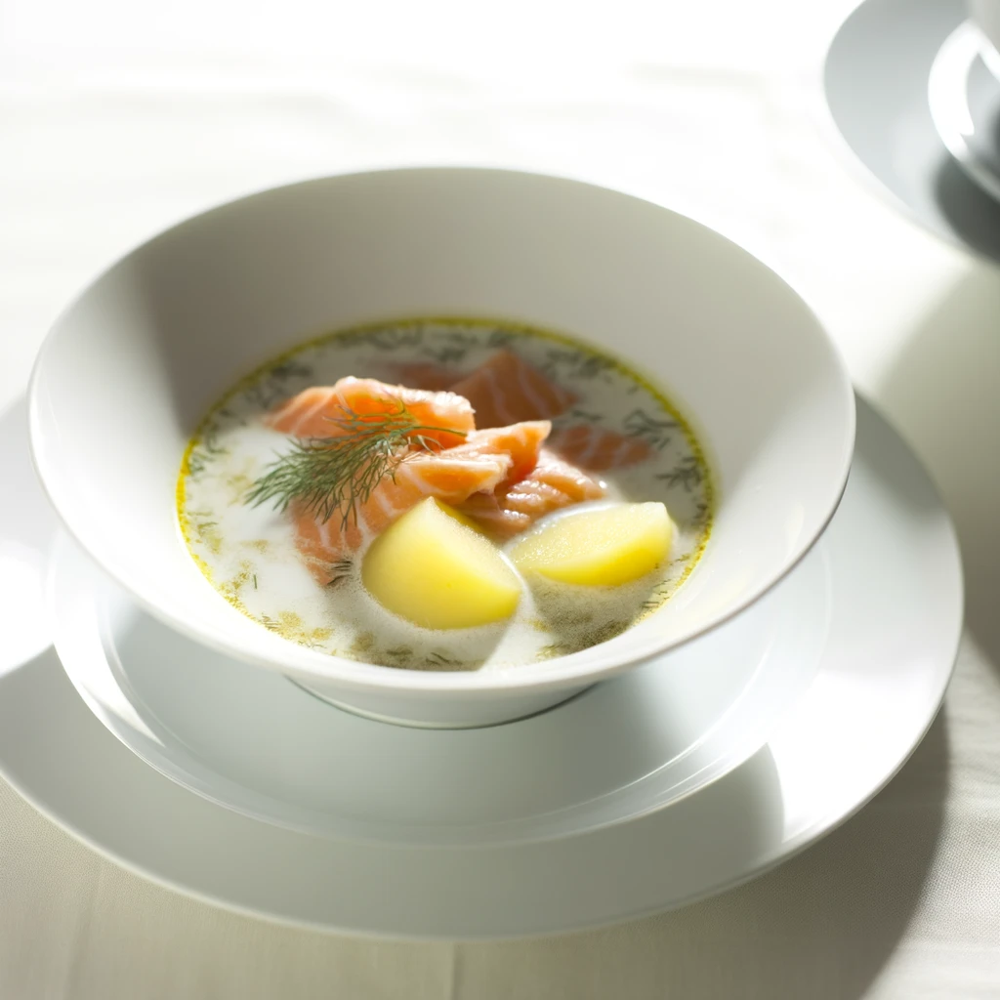
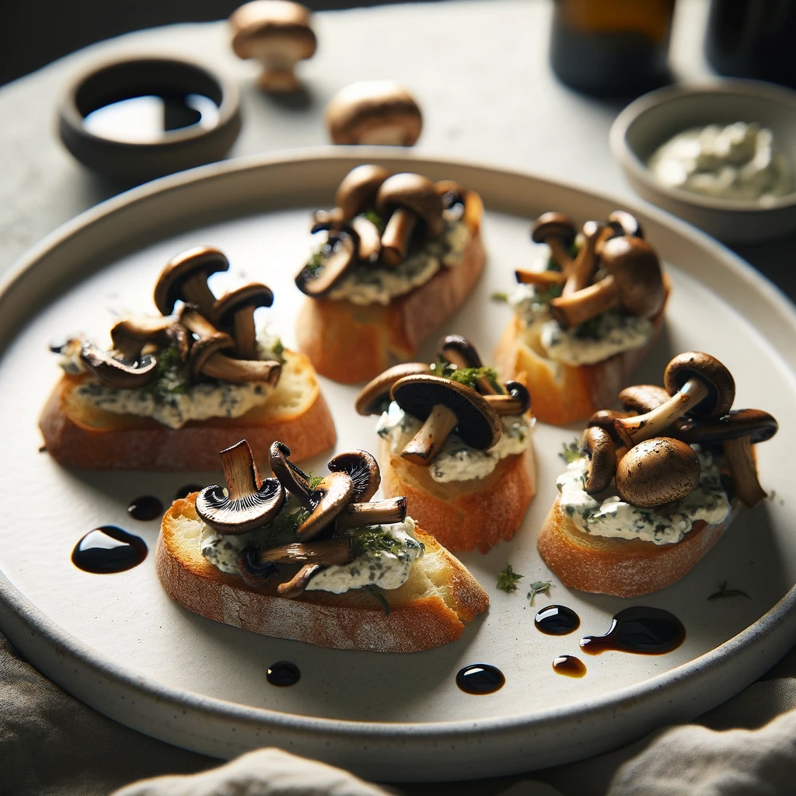
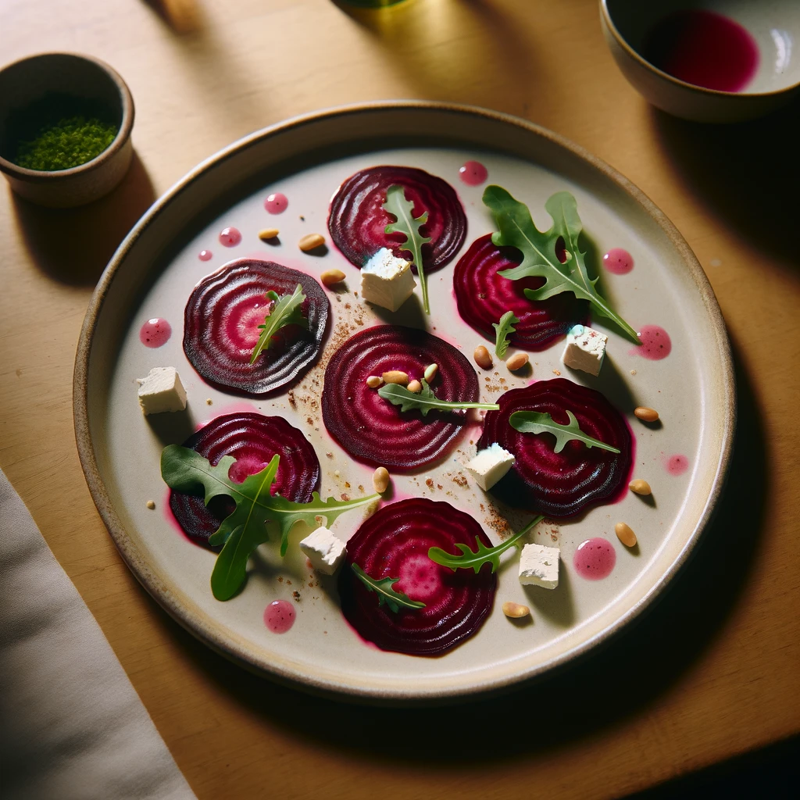
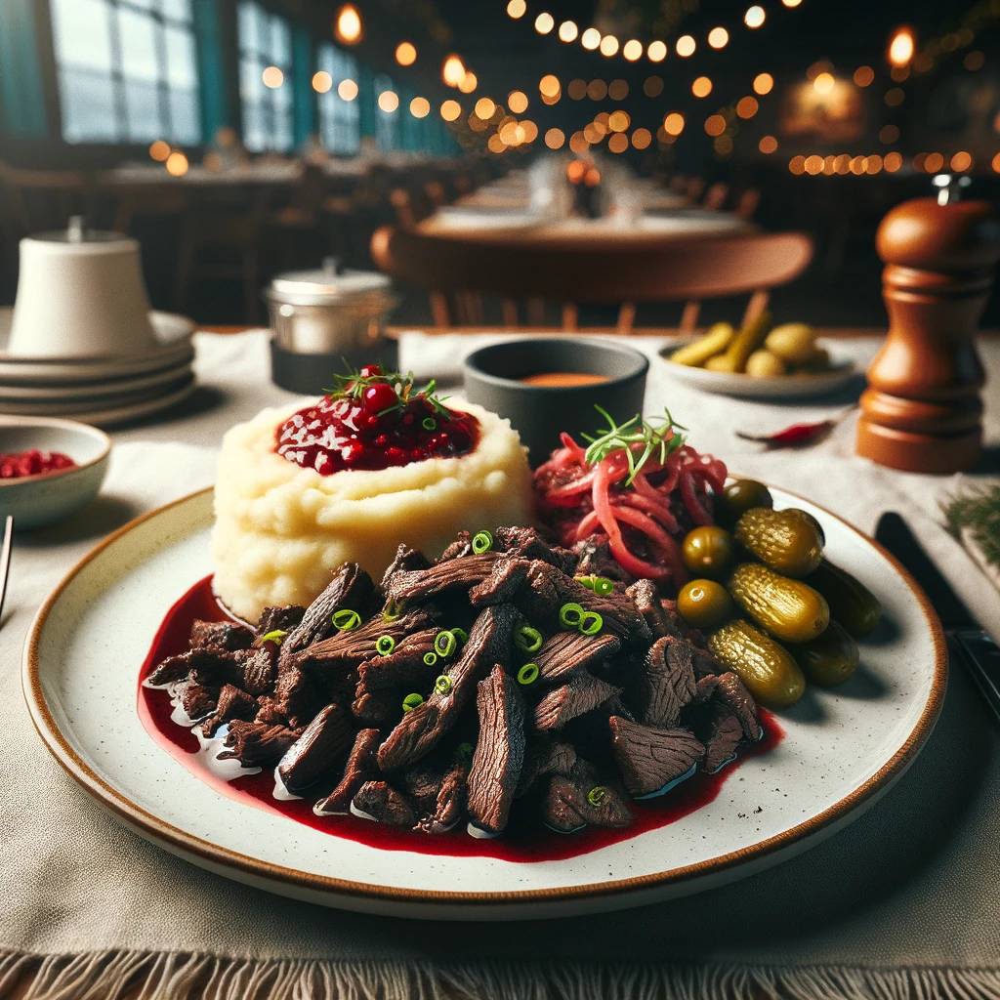
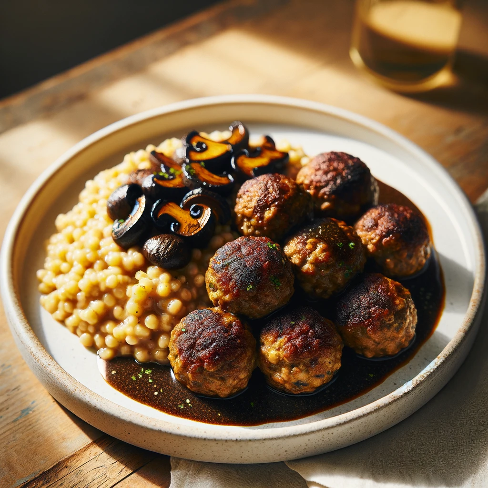
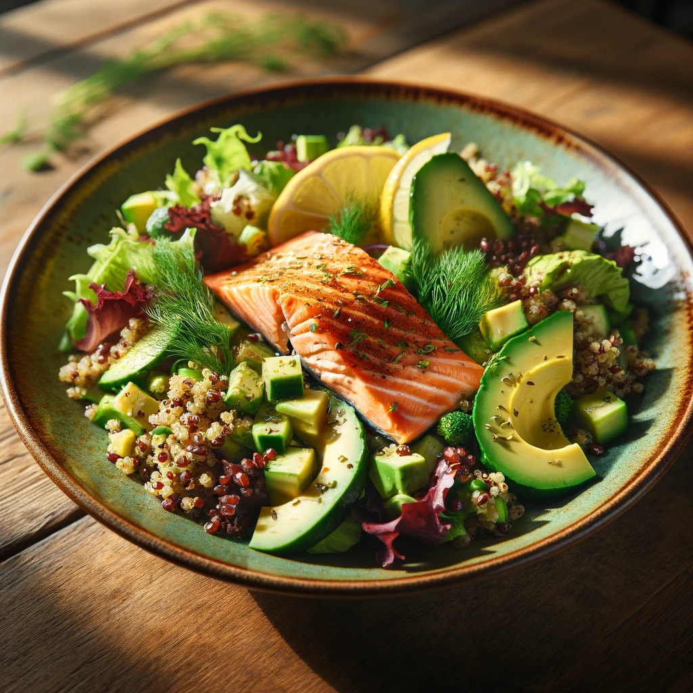

# Kallio Bistro

## Menu

### Starters

- **Lohikeitto**
    > Traditional Finnish salmon soup, enriched with creamy broth, potatoes, and dill.

- **Sieni-Crostini**
    > Wild mushroom crostini, topped with herbed ricotta and a drizzle of balsamic reduction.

- **Punajuuri Carpaccio**
    > Thinly sliced beet carpaccio, served with goat cheese, arugula, and pine nuts, dressed with a raspberry vinaigrette.

### Main Courses

- **Poronkäristys**
    > Sautéed reindeer, a Finnish delicacy, served over mashed potatoes with lingonberry sauce and pickled cucumbers.

- **Kasvispyörykät**
    > Finnish-style vegetarian meatballs made from root vegetables, served with barley risotto and forest mushroom sauce.

- **Lohi-Quinoa Salaatti**
    > Grilled salmon and quinoa salad with mixed greens, avocado, cucumber, and a lemon-dill vinaigrette.

### Desserts

- **Mustikkapiirakka**
    > Traditional Finnish blueberry pie, served warm with vanilla sauce or ice cream.

- **Salmiakki Panna Cotta**
    > A daring twist on the Italian classic, infused with Finnish salmiakki (salty licorice) and served with cloudberry compote.

- **Vegaaninen Suklaa-Unelma**
    > Decadent vegan chocolate dream cake, with a rich, moist texture, served with raspberry coulis.

### Beverages

- **Kotimainen Olut Valikoima**
    > A selection of Finnish craft beers.

- **Kuusenkerkkä Spritzer**
    > A refreshing spritzer made with spruce tip syrup, sparkling water, and a twist of lime.

- **Suomalainen Kahvi ja Tee**
    > Finnish coffee and a variety of teas, including traditional Finnish herbal blends.
